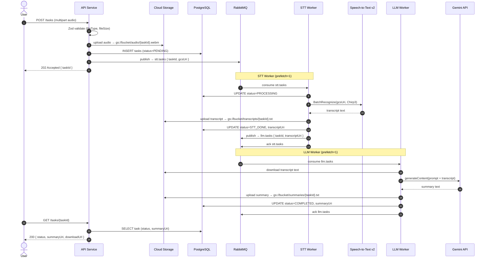
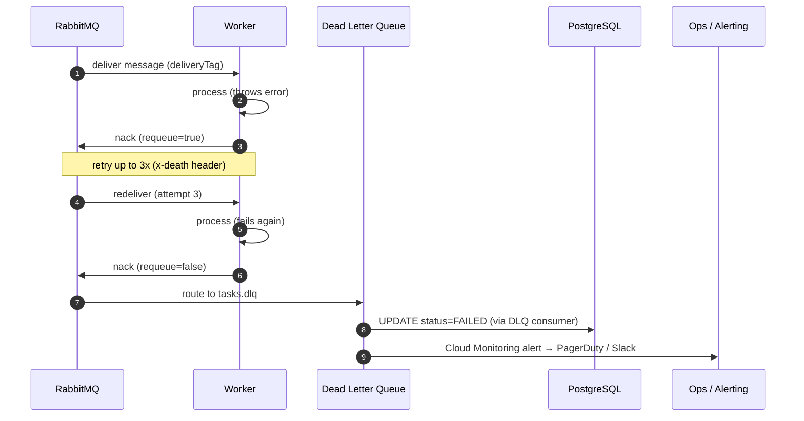

# AI 任務處理平台 — 架構設計文件

---

## 目錄

1. [系統架構圖](#1-系統架構圖)
2. [任務循序圖](#2-任務循序圖)
3. [服務邊界與職責](#3-服務邊界與職責)
4. [技術選型與理由](#4-技術選型與理由)
5. [架構特性說明](#5-架構特性說明)
6. [維運與部署](#6-維運與部署)
7. [架構決策摘要 (ADR)](#7-架構決策摘要-adr)
## 1. 系統架構圖


---

## 2. 任務循序圖

### 主流程：上傳 → STT → LLM → 查詢



### 錯誤流程：重試與 DLQ



---

## 3. 服務邊界與職責

### 3.1 Monorepo 結構

```
packages/
├── api/              # Express 5 HTTP server
│   ├── src/
│   │   ├── routes/   # tasks, health, auth
│   │   ├── schemas/  # Zod schemas → OpenAPI
│   │   ├── services/ # GCS upload, task orchestration
│   │   └── middleware/
│   └── Dockerfile
│
├── stt-worker/       # RabbitMQ consumer — STT pipeline
│   ├── src/
│   │   ├── consumer.ts
│   │   ├── stt.service.ts    # Google Speech-to-Text v2
│   │   └── gcs.service.ts
│   └── Dockerfile
│
├── llm-worker/       # RabbitMQ consumer — LLM pipeline
│   ├── src/
│   │   ├── consumer.ts
│   │   ├── llm.service.ts    # Gemini API
│   │   └── gcs.service.ts
│   └── Dockerfile
│
└── shared/           # Types, Prisma client, logger, tracing
    ├── src/
    │   ├── prisma/   # schema.prisma + generated client
    │   ├── logger.ts # structured JSON (Cloud Logging compatible)
    │   └── tracer.ts # OpenTelemetry setup
    └── package.json
```

### 3.2 各服務職責表

| 服務 | 職責 | 不負責 |
|------|------|--------|
| **API Service** | 身份驗證、輸入驗證（Zod）、GCS 預簽名 URL 生成、任務狀態 CRUD、發佈 MQ 訊息 | 實際 AI 運算 |
| **STT Worker** | 消費 `stt.tasks`、呼叫 Speech-to-Text v2、寫回 GCS + PG、發佈 `llm.tasks` | HTTP 接收、回應 User |
| **LLM Worker** | 消費 `llm.tasks`、呼叫 Gemini API、寫回 GCS + PG | STT 邏輯、HTTP 接收 |
| **PostgreSQL** | 任務 metadata（狀態機、URI 索引）、使用者資料 | 大型 binary 儲存 |
| **Redis** | 任務狀態快取（GET /tasks/:id 加速）、API rate-limit counter | 持久化資料 |
| **GCS** | 音訊檔、逐字稿、摘要的持久儲存，Signed URL 下載 | 業務邏輯 |
| **RabbitMQ** | 解耦 API ↔ Worker、durable queue 確保消息不丟失、DLQ 容錯路由 | 資料儲存 |

### 3.3 資料庫 Schema（核心）

```prisma
model Task {
  id            String      @id @default(cuid())
  userId        String
  status        TaskStatus  @default(PENDING)
  audioUri      String      // gs://bucket/audio/{id}.webm
  transcriptUri String?     // gs://bucket/transcripts/{id}.txt
  summaryUri    String?     // gs://bucket/summaries/{id}.txt
  errorMessage  String?
  retryCount    Int         @default(0)
  createdAt     DateTime    @default(now())
  updatedAt     DateTime    @updatedAt

  @@index([userId, status])
  @@index([createdAt])
}

enum TaskStatus {
  PENDING
  PROCESSING
  STT_DONE
  COMPLETED
  FAILED
}
```

### 3.4 API 端點

| Method | Path | 說明 |
|--------|------|------|
| `POST` | `/tasks` | 上傳音訊，建立任務，回傳 `taskId` |
| `GET` | `/tasks/:id` | 查詢任務狀態與結果 URI |
| `GET` | `/tasks/:id/download` | 取得 Signed URL（逐字稿 / 摘要） |
| `GET` | `/tasks` | 分頁列出使用者任務 |
| `DELETE` | `/tasks/:id` | 刪除任務與相關 GCS 物件 |
| `GET` | `/health` | Liveness / Readiness probe |
| `GET` | `/docs` | Swagger UI（OpenAPI 3.1） |

---

## 4. 技術選型與理由

### 4.1 語言與框架

| 選擇 | 理由 | 取捨 |
|------|------|------|
| **TypeScript strict** | 統一前後端型別、Zod schema 同時作為 runtime validation 與 OpenAPI 來源，減少 schema drift | 編譯步驟、學習曲線 |
| **Express 5** | async/await error propagation 原生支援、生態最成熟、middleware 自由度高 | 比 Fastify 慢約 15-20%，但 I/O bound 任務中可忽略 |
| **Zod + zod-to-openapi** | 單一真實來源（schema-first）：驗證、型別推導、OpenAPI 文件三合一 | 比 Joi 稍慢，但 TypeScript 整合更好 |
| **Prisma 5** | 型別安全查詢、migration 管理、PostgreSQL 16 新特性支援（如 JSONB 索引）| 比 raw SQL 慢，N+1 需手動 `include`，不適合極高頻 OLTP |

### 4.2 雲端平台：GCP

| 服務 | 用途 | 選擇理由 |
|------|------|------|
| **GKE Autopilot** | 容器編排 | 無需管理 node pool，自動 bin-packing，與 GCP IAM / Workload Identity 深度整合 |
| **Cloud SQL (PostgreSQL 16)** | 任務 metadata | HA failover 30s 內、自動備份、Private IP 避免網路暴露 |
| **Memorystore (Redis 7)** | 快取、rate limit | Serverless Redis，支援 IAM auth，無需管理 Redis cluster |
| **Cloud Storage** | 音訊 / 結果儲存 | 無限容量、Signed URL、Lifecycle Policy 自動清理過期音訊 |
| **Speech-to-Text v2 (Chirp 3)** | STT | 支援 Batch Recognize（非同步，適合長音訊）、多語言、低錯字率 |
| **Gemini API** | LLM 摘要 | gemini-2.0-flash：低延遲、低成本，Context Window 1M tokens 足夠長篇逐字稿 |
| **Cloud Armor** | WAF | DDoS 防護、IP 黑名單、rate limiting at edge |
| **Cloud Monitoring + Logging + Trace** | 可觀測性 | 原生整合 GKE / Cloud Run，無需額外 agent |

### 4.3 訊息佇列：RabbitMQ

選 **RabbitMQ** 而非 Kafka 的理由：

- 任務量級：預估峰值 **< 1,000 msg/s**，RabbitMQ 綽綽有餘（Kafka 適合 > 100k msg/s）
- 任務是一次性消費（STT 任務只需一個 Worker 處理），RabbitMQ 的 work-queue 模型更自然
- `prefetch=1` 保證同一 Worker 不會並行處理多個 AI 任務（避免 OOM / GPU 競爭）
- DLQ（Dead Letter Exchange）原生支援，設定簡單
- 若未來需要 event streaming（例如任務進度推播），可同時引入 Pub/Sub

### 4.4 模型服務部署策略

```
選擇：API 模式（Managed Cloud API）

Speech-to-Text v2 → Google 託管 API（Batch Recognize）
Gemini API         → Google 託管 API（generateContent）

理由：
  ✓ 無需管理 GPU 基礎設施與模型更新
  ✓ 按用量計費，無閒置成本
  ✓ SLA 保證，內建 retry/quota 管理
  ✓ Batch Recognize 支援非同步，適合長音訊（> 1 分鐘）

取捨：
  ✗ 資料送出 GCP 邊界（需評估資料合規）
  ✗ 無法自訂 fine-tune 模型（若需客製化，未來可切換 Vertex AI）

擴充路徑：
  若需自部署 → Vertex AI Endpoints（同 GCP 網路，低延遲）
  若需離線推論 → GKE GPU node pool + vLLM container
```

---

## 5. 架構特性說明

### 5.1 可擴充性

```
水平擴展策略：
  API Service   → GKE HPA（CPU / RPS 指標），target 70% CPU
  STT Worker    → GKE HPA（RabbitMQ queue depth 指標）
  LLM Worker    → GKE HPA（RabbitMQ queue depth 指標）
  RabbitMQ      → RabbitMQ Cluster Operator on GKE（3 node quorum queue）
  PostgreSQL    → Read Replica 分攤查詢，Write 走 Primary

Queue 背壓機制：
  任務量暴增時，訊息堆積在 RabbitMQ，Worker 依能力消費
  API 側設定 per-user rate limit（Redis + sliding window）
  避免無限制接受任務導致 DB 與 GCS 爆量

插件式任務擴充（Plug-in Task）：
  新增任務類型只需：
    1. 新增 queue（例如 translation.tasks）
    2. 新增 Worker 服務（packages/translation-worker/）
    3. API 新增 taskType 欄位，路由到對應 queue
  現有服務零改動
```

### 5.2 容錯性

```
故障場景與對應策略：

┌──────────────────┬─────────────────────────────────────────────────┐
│ 故障點           │ 對應策略                                         │
├──────────────────┼─────────────────────────────────────────────────┤
│ STT/LLM Worker   │ 訊息 nack → RabbitMQ 重試（max 3x）→ DLQ       │
│ crash            │ GKE restartPolicy=Always，Pod 自動重啟           │
├──────────────────┼─────────────────────────────────────────────────┤
│ External API     │ Exponential backoff retry（1s, 2s, 4s）         │
│ timeout          │ Circuit breaker（連續 5 次失敗則暫停 30s）       │
├──────────────────┼─────────────────────────────────────────────────┤
│ PostgreSQL       │ Cloud SQL HA（同 region standby，自動 failover） │
│ 故障             │ Prisma connection pool 自動重連                   │
├──────────────────┼─────────────────────────────────────────────────┤
│ RabbitMQ 節點    │ Quorum Queue 3 節點，允許 1 節點失效              │
│ 故障             │ 訊息 durable，不因重啟丟失                        │
├──────────────────┼─────────────────────────────────────────────────┤
│ GCS 寫入失敗     │ Worker 拋例外 → nack → 重試，不更新 DB status    │
└──────────────────┴─────────────────────────────────────────────────┘
```

### 5.3 資料一致性

```
策略：Outbox 模式 + 狀態機保護

1. API 接收上傳後：
   BEGIN TRANSACTION
     INSERT tasks (status=PENDING)
     INSERT outbox (event=stt.task.created, payload={taskId, gcsUri})
   COMMIT

2. Outbox Relay（輕量 cron / 同進程）：
   SELECT unpublished FROM outbox
   → publish to RabbitMQ
   → UPDATE outbox SET published=true

   確保：DB commit 成功才發 MQ，避免「DB 寫入但 MQ 發失敗」的孤兒任務

3. Worker 處理是冪等的：
   - 先寫 GCS，再更新 DB
   - DB UPDATE 使用 WHERE status=<前一狀態>（防止重複消費覆蓋）
   - 若 GCS 已有結果但 DB 未更新 → 重試時重新寫入 GCS（覆蓋相同內容），再更新 DB
```

### 5.4 延遲與效能

```
用戶體驗策略：非同步 + 輪詢 / Push

任務是長時間運算（STT + LLM 可能 10-60 秒），不適合 HTTP long-poll。

方案一（本設計）：輪詢
  POST /tasks → 202 Accepted { taskId }
  GET  /tasks/:id → 輪詢直到 status=COMPLETED
  前端每 3 秒輪詢，Redis cache 降低 DB 壓力（TTL 5s）

方案二（加分）：Server-Sent Events
  GET /tasks/:id/events → SSE stream
  Worker 更新 DB 後，透過 Redis Pub/Sub 通知 API，推播給 SSE 客戶端

效能優化：
  • GCS Signed URL 讓客戶端直接下載結果，API 不過流量
  • Gemini API streaming response（未來可串流摘要給前端）
  • STT Batch Recognize 非同步，Worker 輪詢 Operation 直到完成
  • Read Replica 分攤 GET /tasks 查詢
```

### 5.5 安全性

```
分層防護：

[Edge]
  Cloud Armor：DDoS 防護、OWASP rule set、IP rate limit（100 req/min）

[認證]
  Firebase Auth 或 Cloud Identity → JWT Bearer Token
  API middleware 驗證 JWT，注入 userId 到 request context

[授權]
  Task owner check：GET /tasks/:id 驗證 task.userId === req.userId

[檔案上傳]
  Zod 驗證：MIME type（audio/*）、檔案大小上限（100MB）
  GCS Object Lifecycle：音訊檔 30 天後自動刪除

[網路隔離]
  GKE Pods → Cloud SQL / Redis / RabbitMQ 全走 Private IP（VPC 內部）
  GCS 存取使用 Workload Identity（無需 service account key 檔）

[Secrets]
  全部 API key / DB password 存 Secret Manager
  GKE 透過 Secret Store CSI Driver 掛載，不落 env var 明文

[稽核]
  Cloud Audit Logs：記錄所有 GCS / CloudSQL / Secret Manager 存取
```

### 5.6 可觀測性

```
三支柱：Logs / Metrics / Traces

Logs（Cloud Logging）：
  所有服務輸出 structured JSON，必含欄位：
    { timestamp, severity, traceId, spanId, taskId, userId, service, message }
  Worker 每個階段（consume / api-call / db-write / ack）輸出 INFO log
  錯誤輸出 ERROR log + stack trace

Metrics（Cloud Monitoring）：
  自訂指標（OpenTelemetry → Cloud Monitoring）：
    • task_processing_duration_seconds（histogram，by stage: stt/llm）
    • task_status_total（counter，by status）
    • rabbitmq_queue_depth（gauge，by queue name）
    • external_api_error_rate（counter，by api: stt/gemini）

  GKE 系統指標（自動收集）：
    • CPU / Memory / Pod restart count

Traces（Cloud Trace）：
  OpenTelemetry SDK 植入所有服務
  Trace span 涵蓋：HTTP request → MQ publish → Worker consume → API call → DB write
  W3C Trace Context 在 MQ message header 傳遞，跨服務串連

Alerting（Cloud Monitoring Alerting）：
  • DLQ 訊息數 > 0 → PagerDuty（Critical）
  • task_processing_duration p95 > 120s → Slack（Warning）
  • external_api_error_rate > 5% → Slack（Warning）
  • Pod restart count > 3 in 5min → PagerDuty（Critical）

Dashboard（Cloud Monitoring Dashboard）：
  • 任務吞吐量（tasks/min）
  • 各狀態任務分佈（PENDING / PROCESSING / COMPLETED / FAILED）
  • STT / LLM 平均處理時間
  • Queue depth trend
```

---

## 6. 維運與部署

### 6.1 環境拓樸

```
┌─────────────────────────────────────────────────────────────────┐
│ dev（本機）                                                      │
│                                                                   │
│  docker-compose up                                               │
│  ├── api          :3000                                          │
│  ├── stt-worker                                                  │
│  ├── llm-worker                                                  │
│  ├── rabbitmq     :5672 / 15672 (Management UI)                  │
│  ├── postgres     :5432                                          │
│  └── redis        :6379                                          │
│                                                                   │
│  GCS / Speech-to-Text / Gemini → 使用 .env 指向真實 GCP 服務    │
│  或 mock server（見 packages/mock-services/）                   │
└─────────────────────────────────────────────────────────────────┘

┌─────────────────────────────────────────────────────────────────┐
│ staging（GCP project: my-app-staging）                          │
│                                                                   │
│  GKE Autopilot（asia-east1）                                    │
│  Cloud SQL：1 vCPU / 3.75 GB（db-g1-small）                    │
│  Memorystore：1 GB Basic Tier                                   │
│  RabbitMQ：GKE 單節點（非 HA）                                  │
│  相同 image tag，staging namespace，feature flag 可差異化       │
└─────────────────────────────────────────────────────────────────┘

┌─────────────────────────────────────────────────────────────────┐
│ prod（GCP project: my-app-prod）                                │
│                                                                   │
│  GKE Autopilot（asia-east1 主，asia-northeast1 備）             │
│  Cloud SQL：HA + Read Replica（db-custom-4-15360）              │
│  Memorystore：5 GB Standard Tier（HA）                          │
│  RabbitMQ：Quorum Queue，3 節點                                 │
│  Cloud CDN + Cloud Armor 啟用                                   │
│  Multi-region GCS bucket（asia）                                │
└─────────────────────────────────────────────────────────────────┘
```

### 6.2 CI/CD 流程

```mermaid
flowchart TD
    DEV[Developer\npush / PR]
    CI_TEST[CI: GitHub Actions\npnpm test\npnpm lint\npnpm typecheck]
    CI_BUILD[CI: Build\ndocker build multi-stage\npush to Artifact Registry\ntag: sha-{commit}]
    STAGING_DEPLOY[Deploy to Staging\nHelm upgrade --install\nimage: sha-{commit}]
    SMOKE[Smoke Test\nGET /health\nPOST /tasks mock audio\npoll until COMPLETED]
    GATE[Manual Approval\n審核人員確認]
    PROD_DEPLOY[Deploy to Prod\nHelm upgrade --install\nRolling Update\nmaxSurge=1 maxUnavailable=0]
    MONITOR[Post-Deploy Monitor\n5 分鐘觀察\nerror rate / p95 latency]
    ROLLBACK[自動 Rollback\nHelm rollback\n若 error rate > 1%]

    DEV -->|PR merged to main| CI_TEST
    CI_TEST -->|pass| CI_BUILD
    CI_BUILD --> STAGING_DEPLOY
    STAGING_DEPLOY --> SMOKE
    SMOKE -->|pass| GATE
    GATE -->|approved| PROD_DEPLOY
    PROD_DEPLOY --> MONITOR
    MONITOR -->|正常| DONE[Deploy Complete]
    MONITOR -->|異常| ROLLBACK
    ROLLBACK --> ALERT[通知 Slack / PagerDuty]
```

### 6.3 版本更新與 Rollback

```bash
# 查看目前 release 歷史
helm history ai-platform -n prod

# 手動 rollback 到上一版
helm rollback ai-platform -n prod

# 指定版本 rollback
helm rollback ai-platform 12 -n prod

# Prisma migration rollback（需事先準備 down migration）
# down migration 腳本存放 prisma/migrations/{version}/down.sql
pnpm --filter @app/shared prisma migrate resolve --rolled-back {migration_name}
```

**DB Migration 策略：**
1. 採用 **expand-contract** 模式：新欄位先 nullable 上線 → Worker 雙寫 → 確認後刪舊欄位
2. Migration 在 init container 中執行（`prisma migrate deploy`），確保 Pod 啟動前 schema 已更新
3. 不使用 `prisma migrate dev`（僅 local 使用）

---

## 7. 架構決策摘要 (ADR)

| # | 決策 | 選擇 | 主要理由 |
|---|------|------|------|
| 1 | 任務通訊模式 | 非同步 MQ（RabbitMQ） | AI 任務耗時不確定，同步 HTTP 會 timeout；MQ 提供背壓與重試 |
| 2 | MQ 選型 | RabbitMQ vs Kafka | 任務量 < 1k/s，RabbitMQ work-queue 模型更直觀；Kafka 適合事件流 |
| 3 | STT 部署 | Google Cloud Speech-to-Text v2 API | Batch Recognize 支援長音訊非同步；無需維運 GPU 基礎設施 |
| 4 | LLM 部署 | Gemini API（gemini-2.0-flash） | 低延遲、低成本、1M context；同 GCP 平台網路延遲低 |
| 5 | 結果儲存 | GCS（逐字稿 / 摘要）+ PG（metadata） | 大型文字物件不適合存 DB；GCS Signed URL 讓客戶端直接下載 |
| 6 | 資料一致性 | Outbox Pattern | 保證 DB 與 MQ 同步；避免分散式事務複雜性 |
| 7 | 可觀測性 | OpenTelemetry + Cloud Monitoring | 原生 GCP 整合；Trace ID 跨服務串聯，無需額外 Jaeger 維運 |
| 8 | 認證 | JWT Bearer（Firebase Auth） | Stateless；Worker 不需驗證，只有 API 層需要 |
| 9 | 任務擴充 | Queue-per-TaskType | 新增任務類型只需新增 queue + worker，現有服務零改動 |

---

*文件版本：v1.0 | 最後更新：2026-03-19*
