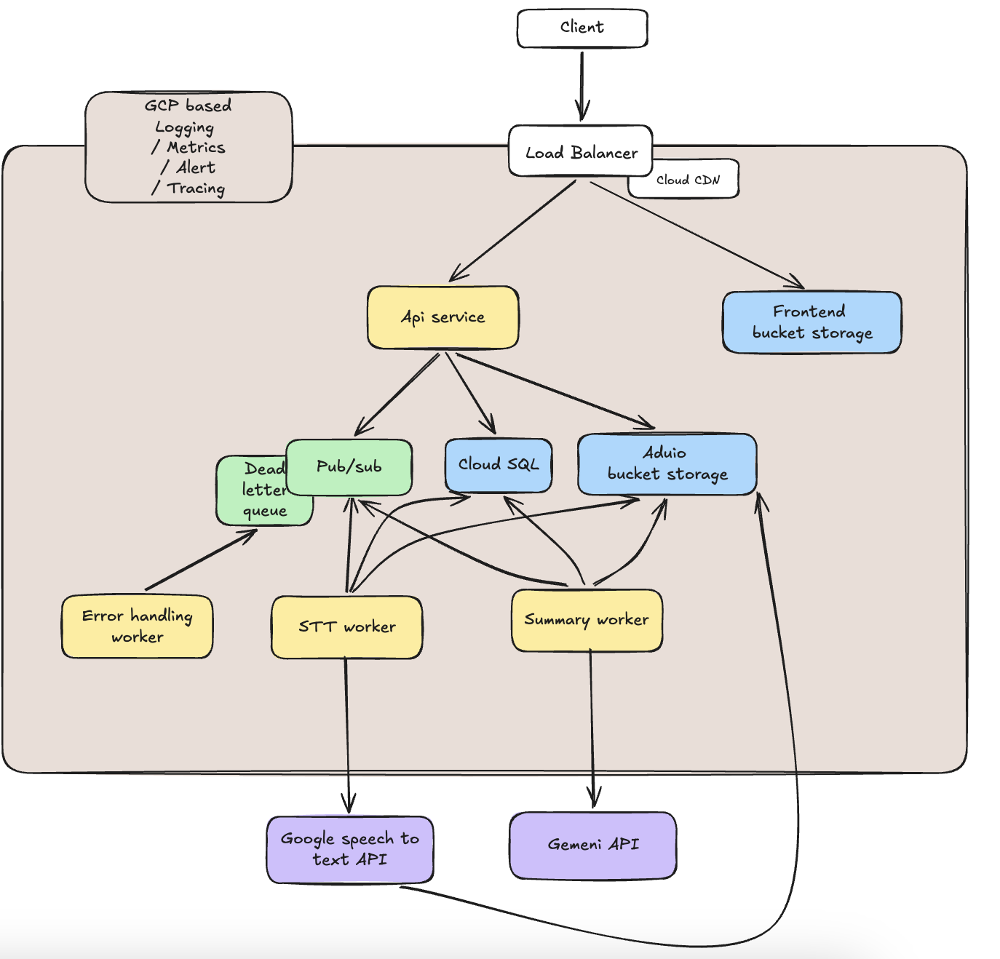
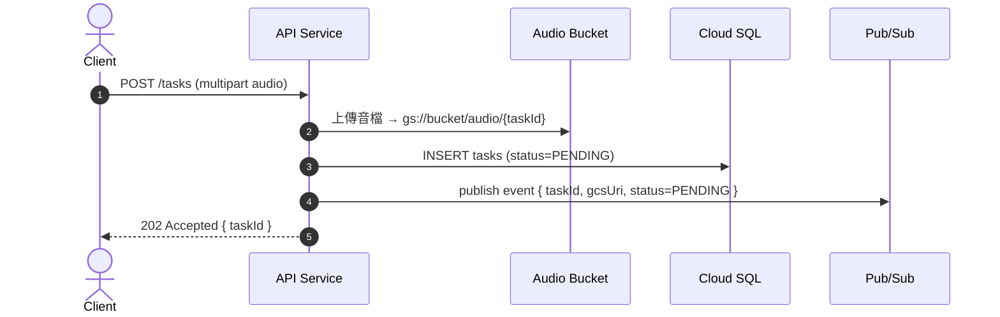
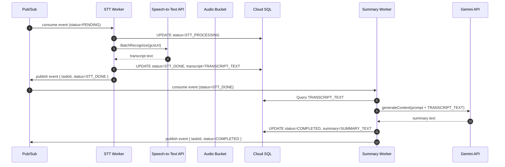
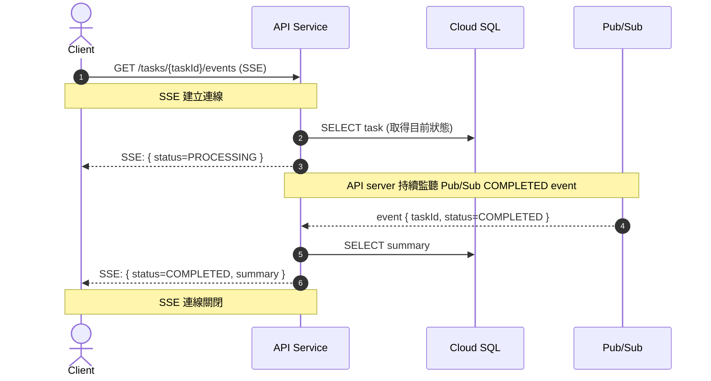
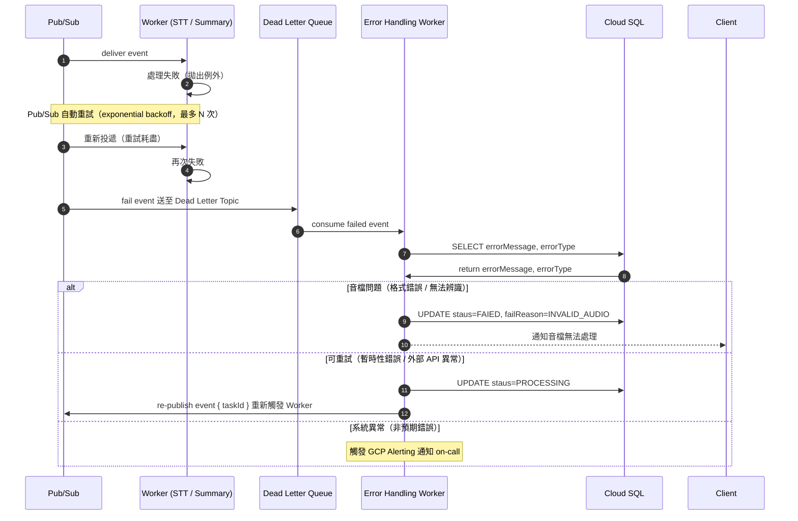
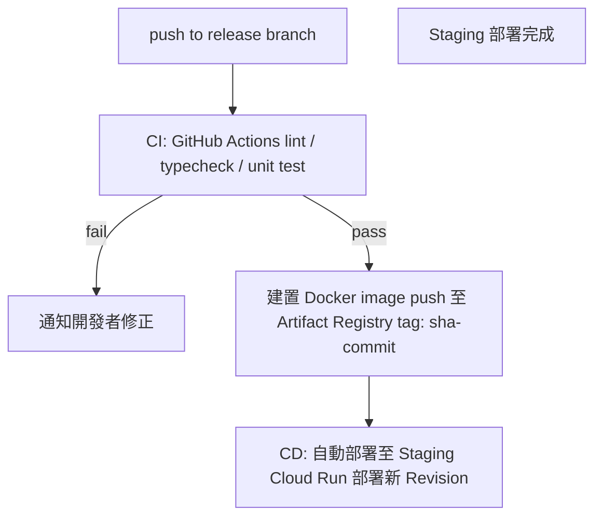
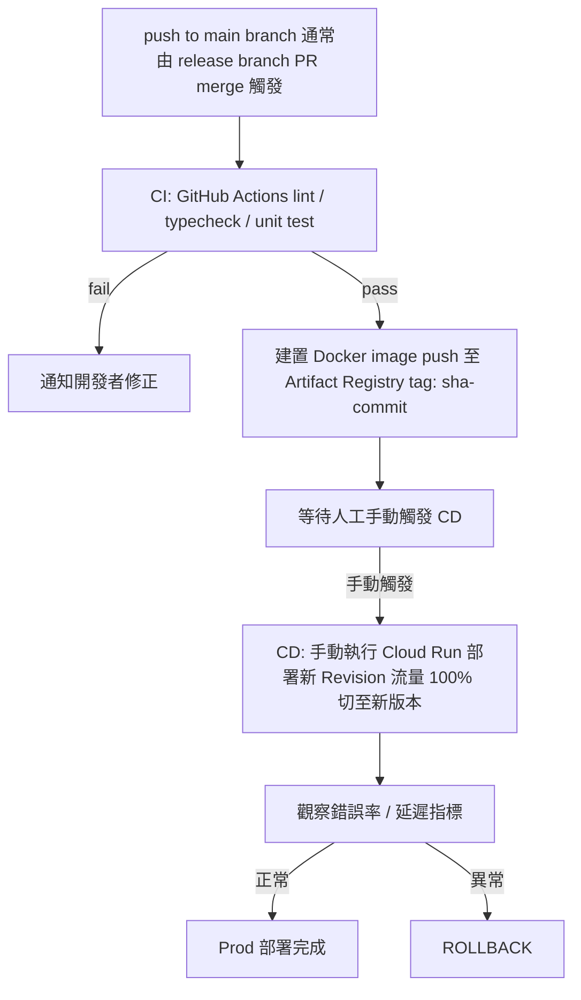

# AI 任務處理平台 — 架構設計文件

---

## 目錄

1. [系統架構圖](#1-系統架構圖)
2. [各服務邏輯邊界與職責](#2-各服務邏輯邊界與職責)
3. [任務循序圖](#3-任務循序圖)
4. [技術選型與理由](#4-技術選型與理由)
5. [架構特性說明](#5-架構特性說明)
6. [維運與部署](#6-維運與部署)

## 1. 系統架構圖



---


## 2. 各服務邏輯邊界與職責

| 服務 | 職責 | 
|------|------|
| **Load Balancer** | 接收所有外部流量，依 path 路由至 Frontend Bucket 或 API Service；整合 Cloud CDN | 
| **Frontend Bucket Storage** | 存放靜態前端資源（HTML/JS/CSS | 
| **API Service** | 上傳音檔至bucket、任務建立、發佈訊息至 Pub/Sub、查詢任務狀態 | 
| **Pub/Sub** | 解耦 API ↔ Worker，分發任務event至 STT Worker 與 Summary Worker | 
| **Dead Letter Queue** | 儲存queue中sub失敗的event，Error Handling Worker後續處理| 
| **STT Worker** | 消費 Pub/Sub 訊息，呼叫 Google Speech-to-Text API，將逐字稿寫回 Cloud SQL，發送summary event至pub/sub| 
| **Summary Worker** | 消費 Pub/Sub 訊息，呼叫 Gemini API，將摘要結果寫回 Cloud SQL | 
| **Error Handling Worker** | 消費 Dead Letter Queue，更新任務狀態為 FAILED，觸發告警通知 | 正常任務流程 |
| **Audio Bucket Storage** | 持久儲存音訊檔、逐字稿、摘要文字物件；提供 Signed URL 下載 | 業務邏輯 |
| **Cloud SQL** | 儲存任務 metadata（狀態機、GCS URI 索引）與使用者資料 | 大型 binary 儲存 |
| **GCP Observability** | 統一收集 Logging、Metrics、Alert、Tracing；Cloud Run stdout 自動匯入 Log Explorer | 應用業務邏輯 |

---

## 3. 任務循序圖

### Step 1. 上傳音檔，取得 task ID



### Step 2. Worker 處理流程

> 各 Worker 訂閱 Pub/Sub，依 event status 處理後發送新 event（帶新 status）至下一階段。



### Step 3. Client 等待結果（SSE）

> API Service 啟動時已訂閱 Pub/Sub 的 COMPLETED event。



### 錯誤流程：重試與 DLQ



---

## 4. 技術選型與理由

### 程式語言與框架（Node.js）

| 選擇 | 理由 | 
|------|------|
| **Node.js + TypeScript** | 統一前後端語言，Node.js的event loop適合非同步 I/O 大量等待外部 API 的 Worker 場景；生態成熟 | 
| **Express**  | 輕量、middleware 自由度高 |

### 雲端平台與服務（GCP）

| 服務 | 選用理由 |
|------|------|
| **GCP SAAS** | 所以服務部屬於同一平台，減少網路溝通費用，各服務可使用GCP原生串接，串接方便，部屬於同一VPC內解少網路設定與維護成本|
| **Cloud Run** | 無需管理容器基礎設施，按請求計費，scaling快速，可根據資源使用率自動scaling，rollback也可直接手動快速切換 |
| **Cloud Load Balancing + CDN** | 全球邊緣節點加速靜態資源；path-based routing 整合 Bucket 與後端服務 |
| **GCP Logging / Monitoring / Tracing** | Cloud Run stdout 自動捕捉 log，無需額外 agent；原生整合告警與 Dashboard，省去自建 ELK/Grafana 維運成本 |

### 資料庫、快取與訊息佇列

| 選擇 | 理由 |
|------|------|
| **Cloud SQL (PostgreSQL)** | 任務 metadata 有強一致性需求；HA failover、自動備份、Private IP 網路隔離 |
| **GCS Bucket** | 與cloud CDN整合，設定簡單，與google speech to text api直接整合，不需透過worker當作中間層多一份網路傳輸成本 |
| **GCP Pub/Sub** | 全託管訊息佇列，原生支援 Dead Letter Topic 與重試策略；與 Cloud Run 整合可用 push 模式，Worker 無需長輪詢 |

### Model 部署策略（API 模式）

採用 **Google 託管 API** 而非自部署模型：

- **Google Speech-to-Text v2（Chirp 3）**：支援 Batch Recognize 非同步處理長音訊，多語言，無需管理 GPU 基礎設施
- **Gemini API**：低延遲、低成本，1M context window 足夠長篇逐字稿，同 GCP 平台網路延遲低

---

## 5. 架構特性說明

### 可擴充性

| 元件 | 擴充策略 |
|------|---------|
| **API Service** | Cloud Run 依 CPU, memory使用量 / 並發請求數自動 scale out，無需手動介入 |
| **Worker（STT / Summary）** | Cloud Run 依 Pub/Sub unacked message count 自動 scale out，任務堆積時自動增加實例，無需手動介入 |
| **Pub/Sub** | GCP 全託管無需設定容量，省去部署 Kafka 或 RabbitMQ 需要管理多節點叢集的人力 |
| **Cloud SQL** | 開啟 HA（熱備援 Standby）保障高可用；另外加 Read Replica 做讀寫分離分攤讀取壓力；寫入仍為單點 Primary，若寫入成為瓶頸需升規或改用 Cloud Spanner |

### 容錯性

| 故障點 | 對應策略 |
|--------|---------|
| Cloud Run 實例異常 | Cloud run設定health check，instance 掛掉自動重啟，Load Balancer 將流量導至健康instance |
| STT / Summary Worker crash | Pub/Sub 訊息未 ack，自動重新投遞給其他健康instance |
| STT/LLM API 暫時不可用 | Worker 拋出例外 → Pub/Sub exponential backoff 重試 |
| Pub/Sub 訊息retry多次未收到ack | 訊息送至 Dead Letter Queue → Error Handling Worker 處理 |
| Cloud SQL 故障 | Cloud SQL HA Standby 熱備援（同步複寫），Primary 故障時自動切換 |

### 資料一致性

| 策略 | 說明 |
|------|------|
| **狀態條件更新** | DB UPDATE 使用 `WHERE status = <前一狀態>`，類似樂觀鎖機制，防止重複消費造成狀態倒退 |

### 延遲與效能

| 策略 | 說明 |
|------|------|
| **非同步架構** | 上傳音檔後API 立即回傳 202，worker在背景處理stt及summary，使用者不需等待 HTTP response |

### 安全性

| 面向 | 策略 |
|------|------|
| **API 存取** | JWT Bearer Token 驗證身份，middleware 注入 userId，所有任務操作驗證 owner |
| **檔案上傳** | MIME type 與檔案大小驗證（audio/* / 上限 100MB），拒絕非法格式 |
| **網路隔離** | 所有服務部署於同一 VPC，Cloud SQL / Pub/Sub 僅允許內部 Private IP 存取 |
| **Secrets 管理** | API key / DB 密碼存於 GCP Secret Manager，Cloud Run 透過 IAM 綁定存取，不在服務上存放.env |
| **CDN / WAF** | Cloud Load Balancing 整合 Cloud Armor，防止 DDoS 與惡意請求 |

### 可觀測性

| 面向 | 做法 |
|------|------|
| **Logging** | 所有服務輸出 structured JSON 至 stdout，GCP 自動捕捉至 Cloud Logging，包含 taskId / status / errorMessage |
| **Metrics** | Cloud Run 原生Metrics 用於監控 Worker 資源使用狀態及request數量 |
| **Alerting** | 設定 Alert Policy：DLQ 訊息數 > 0、Worker 錯誤率異常、Cloud Run 實例數異常以及特定error時，觸發通知 |
| **Tracing** | 每個任務帶 taskId 貫穿所有 log，可在 Cloud Logging 以 taskId filter 追蹤完整處理鏈路 |

---

## 6. 維運與部署

### 部署拓樸（Dev / Staging / Prod）

```
┌─────────────────────────────────────────────┐
│ Dev（本機）                                   │
│                                              │
│  docker-compose up                           │
│  ├── api-service        :3000                │
│  ├── stt-worker                              │
│  ├── summary-worker                          │
│  └── postgres           :5432                │
│                                              │
│  Pub/Sub / bucket / STT / Gemini             │
│  → 使用 .env 直接指向真實 GCP 服務              │
└─────────────────────────────────────────────┘


┌─────────────────────────────────────────────┐
│ Staging/Prod                                 │
│                                              │
│  Cloud Run                                   │
│  ├── api-service                             │
│  ├── stt-worker                              │
│  └── summary-worker                          │
│  Cloud SQL：HA + Read Replica                │
│  Pub/Sub / bucket / STT / Gemini             │
│  → 透過IAM access GCP 服務                     │
│  Cloud Load Balancing + Cloud CDN + Armor    │
└─────────────────────────────────────────────┘
```

### CI/CD 流程

各服務（api-service / stt-worker / summary-worker）獨立部署，流程相同。

**Staging：release branch 自動觸發 CI + CD**



**Prod：main branch 自動觸發 CI，CD 手動執行**



### 版本更新與 Rollback

**版本更新策略：**

**Cloud Run**
每次部署會建立新的 **Revision**，流量預設 100% 切到新版本。若需要灰度測試，可設定流量分配（例如新版 10%、舊版 90%），確認穩定後再全量切換。

**DB**
DB Migration 透過 nodejs db migration 套件管理，每次更版皆會留存更版紀錄

**Rollback：**
Cloud Run 保留歷史 Revision，可在 Console上一鍵切回
DB Rollbakc需停機，
事先準備 down migration 腳本，於 rollback 後手動執行。
人工審核rollback原因，評估僅rollback table 及對應service，或需連data一併rollback

```
